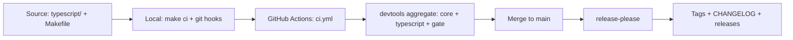

# Architecture

## Purpose

bb-league is a companion web app for a Blood Bowl campaign league: seasons,
teams, match recording, and player progression (experience, injuries,
treasury), following the official Third Season Edition rules (BB2025). It
records and organizes; it never simulates matches.

The repository was generated from ostara-labs/repo-template; the selection
pass kept the TypeScript stack only. It preserves the template's guarantee:
one consistent local and CI experience behind `make`.

## Layout

| Concern | Location |
|---|---|
| Application | `typescript/` (package `@ostara-labs/bb-league`, marker package.json) |
| Shared tooling | .devtools/ submodule (makefiles, CI workflows) |
| CI/CD | .github/workflows/ |
| Domain knowledge | docs/domain/ |

The Makefile aggregates the canonical targets (hooks, deps, format, lint,
test, build, ci, clean); recipes live in the devtools submodule. A second
stack can be added later by re-including its makefile and adding its caller
job (the recipe lives in the template repository).

## Flow

Local gates (git hooks + `make ci`) and the CI gate (the devtools aggregate)
run the same commands, so a green local run predicts a green CI run. Merges
to main trigger release-please, which derives versions and changelogs from
Conventional Commits.

## Where things live

| Concern | Location |
|---|---|
| Local entrypoint | Makefile (canonical targets: help, hooks, format, lint, test, build, ci, clean) |
| Local hooks | devtools git hooks (activate via `make hooks`) |
| CI | ci.yml — one-job caller of the devtools aggregate (pinned by digest) |
| Security scan | .github/workflows/security.yml + .gitleaks.toml |
| Releases | .github/workflows/release.yml + release-please-config.json |
| Governance | AGENTS.md, CONTRIBUTING.md, SECURITY.md, CODE_OF_CONDUCT.md |
| Inventory | MANIFEST.md |
| Decisions | docs/architecture/decisions/ (ADRs) |

## Decisions

Architecture decisions are recorded as ADRs in docs/architecture/decisions/
— see docs/architecture/decisions/0001-record-architecture-decisions.md.

Applied so far:

- Single TypeScript stack (the selection pass). Application architecture
  (framework, persistence, hosting) is deliberately undecided until the
  first features force the choice — each will get an ADR.
